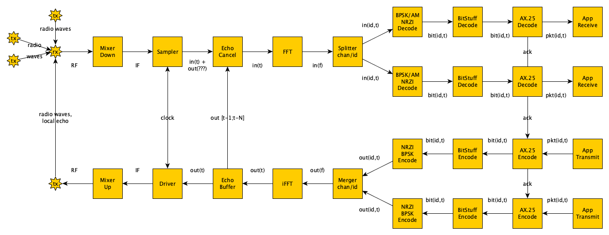
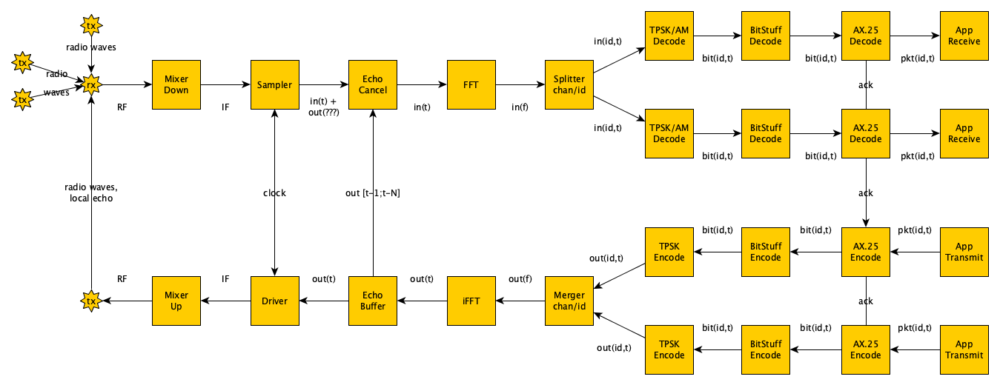

# OrthoModulation and TPSK

> *This repository provides descriptions, models and code for an
> orthogonal radio modulation technique; multiple senders and
> multiple receivers can work on the same frequency band at the
> same time.  TPSK turns the radio channel into a synchronous serial
> device.*

See [documentation](doc/) and the stepwise development of [models](models/).

