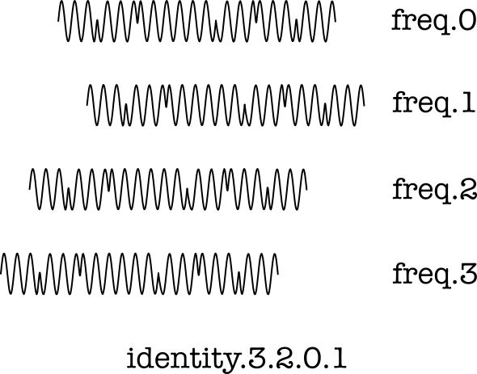

# Channel Identity for OrthoMod

> *Channels need an identity.  How to get to one?*

We distribute the same signal over frequencies in a time-based
order, and use the order to derive an identity.  Receivers are
aware of the identities to match, and may support multiple at
rather low cost, after the FFT has come through.

The picture to keep in mind, simplified to 4 frequencies:

## Many Identities

We can assign a default identity to every receiver, and use
that to reach it.  However, when multiple attempts to transmit
to the same receiver are sent, the risk of a clash is higher.
So, we try to have more channels at the (slight) expense of
analysing them separately after the FFT stage.

Channels may have different identities in both directions.
This introduce no cost for decoding, because the transmitter
and receiver are different processes anyway.  To increase the
likelyhood of spreading transmissions and perhaps allowing us
to drop echo cancellation in some cases, we prefer different
identities for different directions.

## Entropy for Identities

Entropy is the "amount of surprise" that an identity contains.
It helps us to spread identities; the more bits of entropy, the
more opportunity of distinguishing a signal from noise at the
same frequencies (including orthogonal transmissions).

It is commonly accepted that 128 bits of entropy leads to a
globally unique identity.  This assumes that no deliberate
attempts to clashes are made, of course, but other than that
a size of 128 bits is considered unique.

The risk of a clash is not 2^-128 though, it is the square
root of that, so 2^-64 for a 50% risk of a clash, as the result
of the principle of the birthday attack.

Our goal is not to cover the World, but merely a zone of radio
transmissions, and we can adopt 118 bits of entropy with a risk
of 2^-59 of a clash.  We can then have 11e9 people use an average
of 46632982 devices each before we have a 50% risk of an identity
clash.  Given that this follows a
[binomial distribution](https://en.wikipedia.org/wiki/Binomial_distribution),
we should stay below half this, so 11e9 people using an average
of "only" 23316491 devices each.  I suppose *23316491 devices ought
to be enough for anyone*.

Identities form an order, and provided that we cover all frequencies
and none more than once, we can use 32 or 64 frequencies with
32! and 64! identities, respectively.  For 32 frequencies, we then
have 263130836933693530167218012160000000 choices or 118 bits of
entopy; for 64 frequencies, we would have had
126886932185884164103433389335161480802865516174545192198801894375214704230400000000000000
choices or 296 bits of entropy, well over a meaningful range.

Note that we do not limit our FFT to 32 frequencies; it is still
possible to encode multiple frequencies but form 32 groups that
act in unison.  Having more signals helps to increase receiver
sensitivity, but it does not expand the range of identities.

## Automatic Derivation of Identity

It is assumed that context, including higher-layer protocols,
will exchange the identities used in the following OrthoMod ideas
of channel identity.  The derivation of channel identities from this
information is one-directional, and cannot necessarily be reversed.

First and foremost, it is quite possible to create a random identity
from scratch.  The risks of clashes are as low as computed above, and
therefore sufficient for the purpose of OrthoMod radio transmissions.
It suffices to produce 118 bits of entropy, more is not problematic
but less increases the risk of clashes.

Second, a number of derived forms can also be imagined.  These would
apply to radio amateurs that use their call signs.  In this case,
clashes are prevented due to the global allocation scheme for unique
names.  OrthoMod does not require call signs anywhere, and facilitates
the random forms at the same level of functionality.  The representation
of the call sign in its smallest UTF-8 form is used to identify a
radio amateur, plus an uppercase hex digit to identify a station,
with 0 as the default station.  For PA1RVR, the complete default
code is then the string "PA1RVR0".

In both cases, the code would designate an end point, not a channel.
When communication is sent outside of a connection, then the identity
for the OrthoMod frequency hopping identity is the SHA256 output of
the bytes for the end point designation.  This includes the messages
that request a new connection to be created, because their sender is
not yet known to the recipient for the request.

Channels that are used during a connection, including responses that
acknowledge a connection request and ones that terminate a connection,
are sent from an end point whose designation should be known at the
recipient.  For that reason, they can be sent with another channel
identity, leaving room for other unconnected messages.  The new
channel identity consists of the SHA256 of the transmitter rotated
over half of its byte length, XORed with the SHA256 of the receiver
which has not been rotated.  Note how the channel identities differ,
but are merely a byte-rotated version of one another. 

## Frequency Hopping for an Identity

Given an identity, we need to derive a frequency hopping scheme
from the SHA256 outputs.  In all cases, we use div/mod arithmetic
applied to the whole number.  We will only use the initial 16 bytes
or 128 bits, and split it into 16-bit words in big-endian order
that we div/mod with a number of values.  When a remainder exists,
it is added to the next 16-bit word and truncated to an unsigned
16 bit integere before we process that.

The first choice covers 32 options, the next 31 and so on, until
we reach 2 choices only.

  * Short #0 is div-modded by 32, 31, 30 (29760 combinations).
  * Short #1 is div-modded by 29, 28, 27 (21924 combinations).
  * Short #2 is div-modded by 26, 25, 24 (15600 combinations).
  * Short #3 is div-modded by 23, 22, 21 (10626 combinations).
  * Short #4 is div-modded by 3, 2, 20, 19, 18 (41040 combinations).
  * Short #5 is div-modded by 7, 16, 15, 14 (57120 combinations).
  * Short #6 is div-modded by 13, 12, 11, 10 (17160 combinations).
  * Short #7 is div-modded by 9, 8, 7, 6, 5, 4 (60480 combinations).

The early div/mod for 3 and 2 helps to limit the range; the values
will be remembered for later use, of course.

At every stage, there is a list of frequencies (or frequency groups),
ranging from low to high.  Initially, this starts with `freq.0` and
ends with `freq.31` to give it a few symbolic names.

Every choice selects a value from that list, and removes it.  The
div-modded value used is indicated by the number of entries left.
The last remaining value is concatenated to the output list.

**Code:** See [split118.py](../models/split118.py) for numbers.

### Example Identification

Let's say PA1RVR is about to transmit from station 3 to station 12.
The stations bear designations "PA1RVR3" and "PA1RVRC", with the
following SHA256 values in hex notation:

  * `13cb1ed8e701e697073c9ba5645d159d3e8b33457ffd76230fb8847d7d62e77e`
  * `2b75cc999c69d12deb782093bd934d32d2fe3da94daaf6992a94358663ef0b1c`

The rotated channel identities, used to blend in the transmitter, are:

  * `3e8b33457ffd76230fb8847d7d62e77e13cb1ed8e701e697073c9ba5645d159d`
  * `d2fe3da94daaf6992a94358663ef0b1c2b75cc999c69d12deb782093bd934d32`

We shall XOR the binary values below the hex, take the first half,
split it into big-endian values of 16 bits and call the result our
channel identity.  We then obtain the frequency hopping scheme that
matches this channel identity.

When PA1RVR3 transmits to PA1RVRC, the channel identity is, depending
on the form you prefer:

  * `15feffdce394a70ee4c0a4eec0f1aa4c`
  * `15fe`, `ffdc`, `e394`, `a70e`, `e4c0`, `a4ee`, `c0f1`, `aa4c`
  * 5630, 65500, 58260, 42766, 58560, 42222, 49393, 43596

and the corresponding frequency hopping plan is:

  * 30, 20, 5, 19, 21, 31, 26, 16, 22, 13, 12, 0, 1, 23, 10, 24, 6, 9, 25, 14, 17, 27, 28, 4, 11, 8, 7, 29, 15, 3, 18, 2

When PA1RVRC transmits to PA1RVR3, the channel identity is, depending
on the form you prefer:

  * `c1352371aaab100e2da8ae2307b21e81`
  * `c135`, `2371`, `aaab`, `100e`, `2da8`, `ae23`, `07b2`, `1e81`
  * 49461, 9073, 43691, 4110, 11688, 44579, 1970, 7809

and the corresponding frequency hopping plan is:

  * 21, 27, 19, 29, 4, 12, 13, 6, 25, 24, 2, 11, 14, 3, 9, 10, 30, 28, 22, 17, 18, 1, 5, 23, 15, 16, 20, 8, 0, 7, 26, 31

**Code:** See [freqhop.py](../models/freqhop.py) for a demonstration,
callable with the designations for a transmitter and receiver.

**Note:** The entropy of this is not optimal.  We might prefer 32-bit
chunks instead of 16-bit chunks.  Given that we rely on SHA256,
this may be a reasonable assumption; in cases where that needs to be
computed upstream from the radio than so can the frequency hopping.

