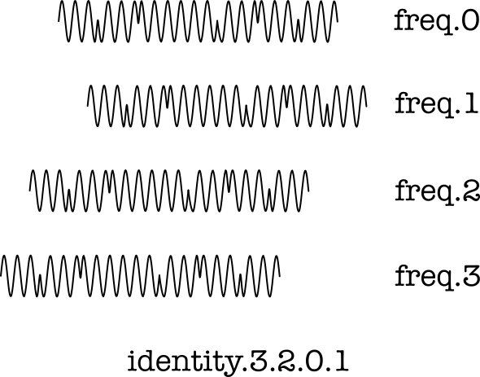
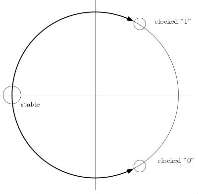

# OrthoMod use of Probability in Signal Detection

> *A vital part of OrthoMod is the ability to separate signals
> targeted at different identities.  The mechanism for this is
> based on probabilities and their combination.  The underlying
> encoding is selected to support this probabilistic detection
> model.*

**TODO:** This part of OrthoMod is still premature and immature.

A simplified model of the signal over 4 frequencies looks like this:

The entropy of the identities is discussed as part of the
[channel identity document](ChannelIdentity.md)
and is good for 118 bits of entropy for 32 frequencies
that all transmit the same signal at some point in time.
We now turn to the detection of the correlated signal
over those frequencies.

## Nyquist and Continuous Time

The [Nyquist sampling theorem](https://en.wikipedia.org/wiki/Nyquist%E2%80%93Shannon_sampling_theorem)
states that we need to sample at least twice as often
as the highest frequency to be sampled.  Given that this
is observed, any signal should be reproducable with an
FFT.  In practice however, the boundaries of an FFT may
be different for transmitter and receiver, causing fuzz,
also as the result of most signals not being repetitive.

However, as soon as we have the 32 frequencies being
used, we have an idea of how often to sample.  And as
a result of the theorem, we can assume that transmitter
and receiver do not need to be synchronised as long as
a maximum to the frequencies transmitted is observed.
Techniques such as filtering and/or oversampling can
help us get there.

Given this condition, it is possible to consider the
time as a continuous scale.  We therefore do not need
to determine an encoding when we detect channels and
split the FFT output over the channel identities that
the receiver listens for.

## Uncertainty from Abstraction Matching

Every individual measurement can vary in its degree
of certainty.  This is why we transmit the abstract
notions of TPSK or NRZI/BPSK and receive them with
more abundant semantics, herein described as TPSK-AM
or NRZI/BPSK-AM.

When we receive a accurate movement on a frequency
that clearly matches the transmitted abstraction and
perhaps the amplitude/phase and speed of change, then
we can be confident about the result.  When we can see
that we receive multiple signals, such as a "1" as
well as a "0" signal then we cannot be certain what
to pass on, though we might detect one value as a
stronger (and thus more likely) one.

In short, it is possible to derive a degree of
certainty from each FFT sample, possibly in comparison
to its prior value.  The precise method remains open
to be derived, and depends on the modulation used.

Another measurement of interest is the amplitude of
a change; this ought to be reasonably constant for a
given transmitter.

Note that BPSK/NRZI does not distinguish "1" from
"no change", so the output provides less information
than TPSK which was specifically designed to provide
an optimal separation of all three these concepts.

In TPSK, the transmission of a "1" or "0" is always
explicit, and so it involves a clock signal.  To make
this possible, a third value "no change" is represented
by a stable frequency.  The output of a TPSK detector
would be a data line with a clock signal, whereas the
model for BPSK or BPSK/NRZI would be a data line with
a fixed clock.

## Composing Uncertain Measurements

A channel identity prescribes a progression sequence
of frequencies, or a frequency hopping order.  When
received signals are considered as a sequence of such
frequencies, it is possible to look for a pattern by
overlaying the (time-shifted) signals.  In practice,
this means looking at the frequencies one at a time,
in an order dictated by the FFT sampling frequency.

This works best when the FFT sampling frequency is a
whole number *k* times the fixed pace of frequency hopping.
Compositions simply reach *k* samples in the past, and
when uncertain they will probably integrate more of the
preceding (and/or following) signal(s).

The least selective composition is addition of values
that occur as frequency hops but that should otherwise
describe the same original-time signal.  For a basis of
32 frequenciesthis produces an amplification of 32 times
or 30 dB.  (More frequencies would yield higher values,
and may help in special cases like Moon bouncing.)

The most selective composition is multiplication of
1.0 for a good signal and 0.0 for a bad one.  This is
going to block anything that is not completely correct,
a recipe for disaster.

The optimal solution usually lies somewhere in the middle.
Given that new transmitters may add at any time, to any
frequency and with any amplitude and path delay, it is
probably best to be highly adaptive; that is, to adapt
at the level of an individual measurement.  This can be
done if the certainty of an individual measurement is
known.

A consistent volume is an indication of a good match.  An
accurate phase change is an indication of a good match.

A measurement that is 100% certain has more impact than
one at 25% certainty.  These certainties may differ for
the "1", "0" and perhaps "no change" variants.  In
general, the possible abstract conclusions that make
sense to the following demodulator.  Note that this is
closer to the radio signal than to the digital signal;
the actual information relayed for BPSK would be the
chance of being in one of two phases and for TPSK it
would be the chance of being in one of three phases.
The result therefore is a "cleanup" of the radio signal
in support of demodulator processing.

This means that the purpose of the detector (for a given
channel identity) is to convey a **probability distribution
for modulation abstractions**.
The 32 probability distributions from the frequencies
in the expected hopping order are composed,
mindful of the underlying
[binomial distribution](https://en.wikipedia.org/wiki/Binomial_distribution)
for the composition.

**Note:** Is there such a thing as a
[trinomial distribution](https://en.wikipedia.org/wiki/Pascal%27s_pyramid#Trinomial_distribution_connection)
to accomodate the model for TPSK?

In terms of probability theory, we need to produce a
[conditional probability](https://en.wikipedia.org/wiki/Conditional_probability)
for each of the modulation's abstract values.  It is not
a bad idea to produce a probability for the overall result
alongside the result itsel, to allow higher layers in the
protocol stack to do something useful with it, such as
finding the best candidates for error recovery.  Not all
higher layers may be interested, howeever.  It is also
possible to use the uncertainty in the production of
outcomes between the abstractions of the modulation.

The conditional probability should be used for the
composite of 32 frequencies, not for each individual
frequency.  The individual frequencies are mostly useful
as producers of the signal-with-uncertainty, and the
values are independently processed until their composition
through a conditional probability computation.

